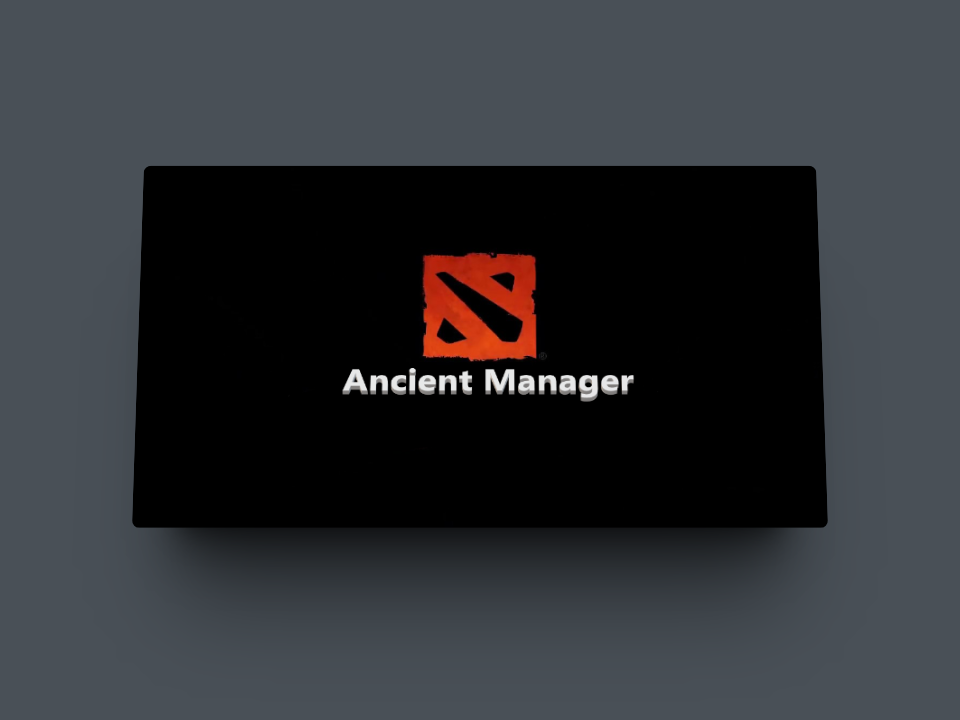

# AncientManager
AncientManager appears during my first year as a university student where everyone was fighting over who was the best Dota 2 player, so applying the first knowledge of C++ programming acquired at that time, I created this console application in C++ using structural programming to obtain various statistics and comparisons between players using the data from each tournament that was held.

## Tools
C++ - Programming Language

## Preview

